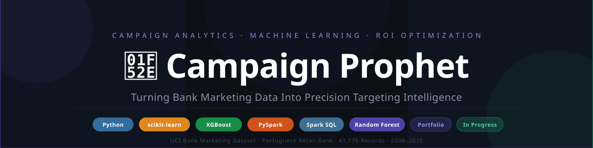
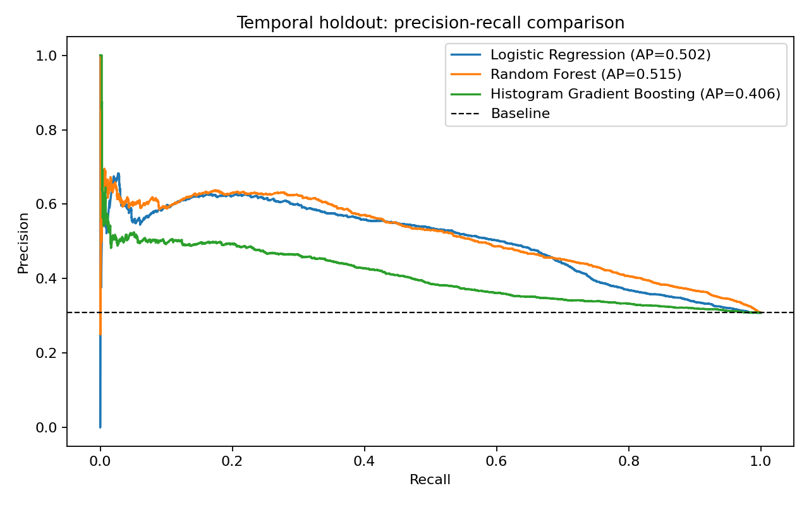
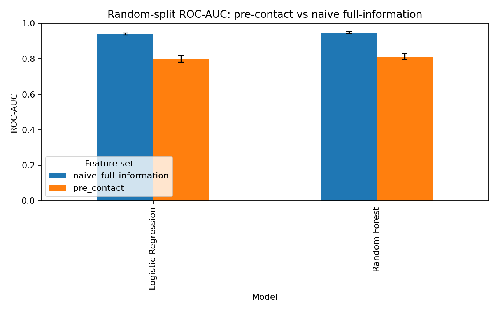
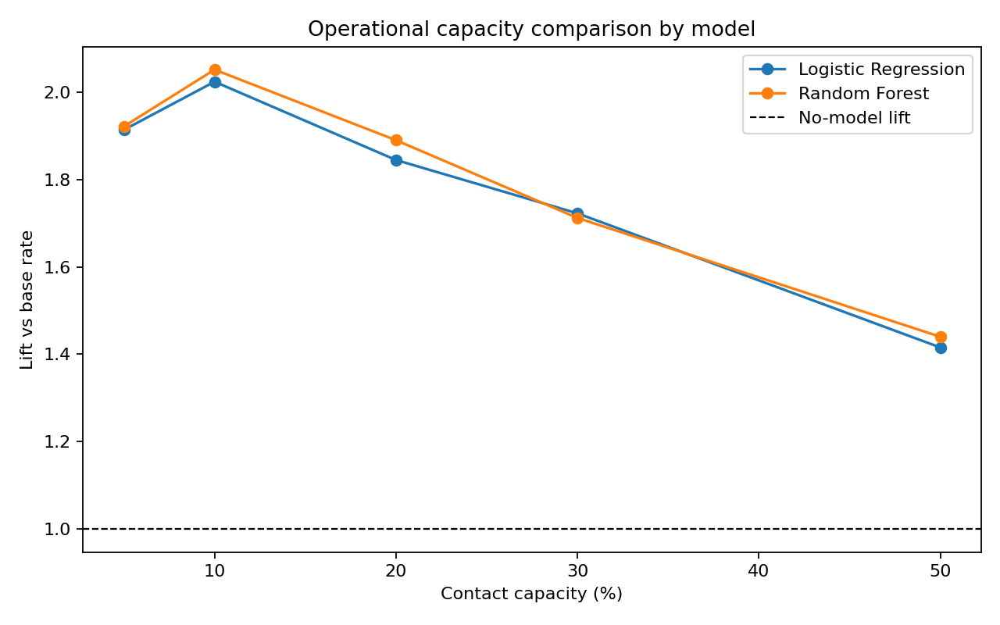
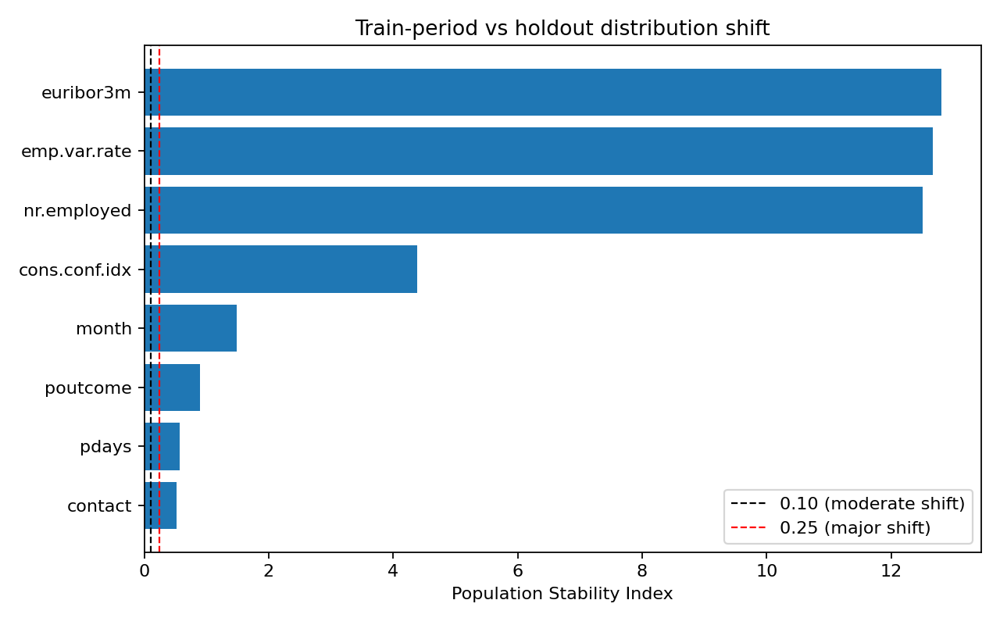
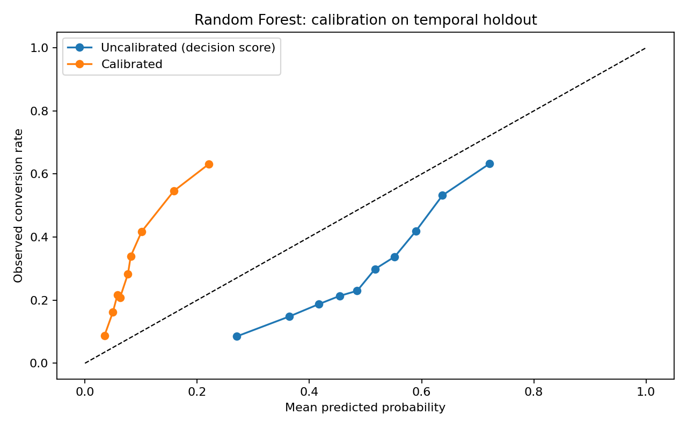
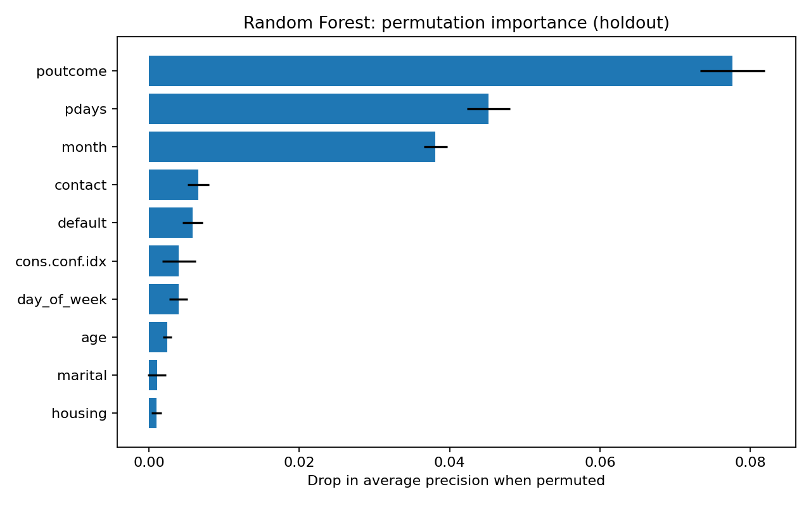
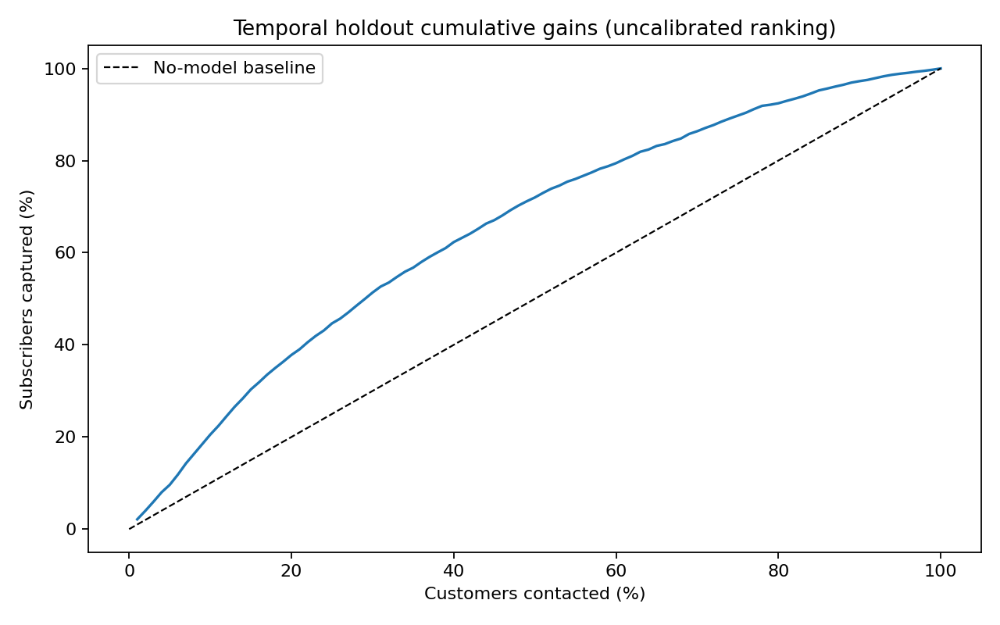
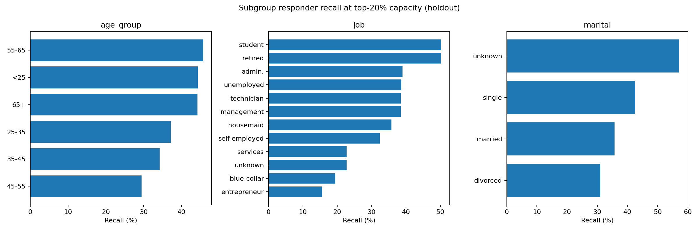

<div align="center">



<br/>

[](https://python.org)
[](https://scikit-learn.org)
[](https://pandas.pydata.org)
[](https://github.com/Lakshmi-Sindhu-P/Campaign-Prophet)
[](https://github.com/Lakshmi-Sindhu-P/Campaign-Prophet)
[](tests/test_pipeline_contract.py)
[](https://github.com/Lakshmi-Sindhu-P/Campaign-Prophet/actions/workflows/pipeline.yml)
[](LICENSE)

<br/>

> **A reproducible pre-contact decision-support system that ranks bank customers for
> term-deposit outreach using only information available before a call — and *demonstrates*
> the leakage cost, the temporal-shift cost, and the capacity/coverage trade-off rather
> than hiding them.**

<br/>

<sub><b>V2 build</b> — pre-contact decision-support rework (Phases 1–6)</sub>

<br/>

[📊 Overview](#-overview) &nbsp;·&nbsp;
[⚖️ Feature Policy](#%EF%B8%8F-feature-policy) &nbsp;·&nbsp;
[🤖 Models](#-model-performance) &nbsp;·&nbsp;
[🔑 Findings](#-key-findings) &nbsp;·&nbsp;
[🎯 Targeting Results](#-targeting-results) &nbsp;·&nbsp;
[📓 Notebooks](#-notebook-workflow) &nbsp;·&nbsp;
[📸 Visuals](#-visual-outputs) &nbsp;·&nbsp;
[🗺️ Roadmap](#%EF%B8%8F-roadmap) &nbsp;·&nbsp;
[🛠️ Setup](#%EF%B8%8F-setup) &nbsp;·&nbsp;
[📬 Connect](#-connect)

</div>

---

## 📊 Overview

A Portuguese retail bank ran thousands of outbound phone calls between **May 2008 and November 2010**, trying to sell term-deposit subscriptions. Only **11.27%** said yes. The operational question is simple: **who do we call first when capacity is limited?**

Campaign Prophet answers it with **pre-contact** models only — every feature must exist *before* the call starts.

<br/>

| Layer | Question Answered |
|:------|:-----------------|
| 📈 **Descriptive** | Which segments converted more often? |
| 🔬 **Inferential / validity** | What did the leakage controls really cost? |
| 🤖 **Predictive** | Who will subscribe *before* we make the call? |
| 🎯 **Prescriptive** | How much responder coverage does a contact capacity buy? |

<br/>

### Dataset at a Glance

| | |
|:---|:---|
| 📁 **Source** | UCI Bank Marketing Dataset — Moro, Cortez & Rita (2014) |
| 🧹 **Records** | **41,176** after removing 12 duplicates from 41,188 |
| 🎯 **Positive class** | **11.27%** — 4,639 subscribers out of 36,537 non-subscribers |
| 📐 **Features** | 21 raw predictors; **19 operational** after the feature policy |
| 📅 **Period** | May 2008 – November 2010 |
| 💶 **Currency context** | Euro — Portuguese retail banking |

<details>
<summary>🔍 &nbsp;<b>Expand dataset provenance</b></summary>

<br/>

The processed, feature-engineered CSV is tracked at
`data/processed/cleaned_feature_engineered_bank_marketing.csv`. Raw UCI archives are
deliberately **not committed**; run `scripts/prepare_data.py --refresh-data` to download
and rebuild them from the public source.

The five macroeconomic columns (`emp.var.rate`, `cons.price.idx`, `cons.conf.idx`,
`euribor3m`, `nr.employed`) are **Banco de Portugal published statistics** embedded in the
dataset by the original authors — not a separate external feed.

</details>

---

## ⚖️ Feature Policy

A model that needs call duration to predict a subscription **cannot decide who to call**. The operational model therefore excludes every post-contact field.

<br/>

| Feature group | Fields | Availability | Treatment |
|:--------------|:-------|:-------------|:----------|
| Customer demographics | `age` `job` `marital` `education` `default` `housing` `loan` | Pre-contact | ✅ Included |
| Campaign planning | `contact` `month` `day_of_week` | Pre-contact | ✅ Included |
| Prior-contact history | `pdays` `previous` `poutcome` | Pre-contact | ✅ Included |
| Macroeconomic context | `emp.var.rate` `cons.price.idx` `cons.conf.idx` `euribor3m` `nr.employed` | Pre-contact | ✅ Included |
| Current-call outcomes | `duration` `campaign` | Known during/after the call | ❌ Excluded |
| Target / helpers | `y` `success` `age_group` `duration_category` | Outcome or derived | ❌ Excluded |

Full policy in [`docs/data_dictionary.md`](docs/data_dictionary.md).

<details>
<summary>💸 &nbsp;<b>Scenario economics (labeled assumptions, not observed bank figures)</b></summary>

<br/>

The dataset contains **no actual cost, deposit value, or customer lifetime value**.
USD and EUR scenarios live in [`config/roi_scenarios.json`](config/roi_scenarios.json) and
are used only as clearly-labeled sensitivity assumptions — never as observed results.

| Currency | Conservative | Base Case | Optimistic |
|:---------|:-------------|:----------|:-----------|
| 💵 USD | \$15 / \$300 | \$10 / \$500 | \$5 / \$1,000 |
| 💶 EUR | €12 / €150 | €10 / €250 | €7 / €450 |

*(cost per contact / revenue per success)*

With constant cost and revenue across customers, ROI rankings necessarily track conversion
rate. The project therefore reports **relative coverage and lift**, and makes **no financial
targeting recommendation**.

</details>

---

## 🤖 Model Performance

Models are selected by Average Precision on an **internal validation slice of the training period**. The final 20% source-order holdout is touched **once**, for reporting only. `duration` and `campaign` are excluded from every operational model.

<br/>

| Model | Benchmark ROC-AUC | Benchmark AP | Holdout ROC-AUC | Holdout AP |
|:------|------------------:|-------------:|----------------:|-----------:|
| 🥇 🌲 **Random Forest** `operational` | **0.8126** | **0.4822** | **0.7180** | **0.5151** |
| 🌳 **Histogram Gradient Boosting** `boosting` | 0.8047 | 0.4759 | 0.5990 | 0.4059 |
| 📐 **Logistic Regression** `baseline` | 0.8009 | 0.4439 | 0.6953 | 0.5017 |

<br/>

**Random Forest** leads on ranking quality and is the operational model, selected on the internal validation slice. The pipeline runs a **three-model comparison** — Logistic Regression, Random Forest, and Histogram Gradient Boosting. All three are pure scikit-learn, so there is **no system OpenMP dependency** and the pipeline is reproducible across platforms and CI.

<details>
<summary>🎛️ &nbsp;<b>Hyperparameter sensitivity: defaults stand (measured, not asserted)</b></summary>

<br/>

A small grid per model is scored on the **internal validation slice only** (the final holdout is never used for tuning). The best config per model:

| Model | Best config | Validation AP | Default AP | Δ |
|:------|:------------|--------------:|-----------:|--:|
| Random Forest | `trees200` | 0.1693 | 0.1684 | +0.0009 |
| Histogram Gradient Boosting | `small` | 0.1619 | 0.1483 | +0.0136 |
| Logistic Regression | `C0.1` | 0.1353 | 0.1344 | +0.0009 |

No config materially improves validation ranking, and tuned HGB still trails untuned Random Forest — so the shipped defaults stand. Full grid in `outputs/notebook_02/tuning_sensitivity.csv`. This is the evidence behind "no tuning", not a claim.

</details>

<details>
<summary>🔓 &nbsp;<b>The leakage cost, measured (not asserted)</b></summary>

<br/>

A naive model allowed to use `duration` and `campaign` is trained on the **same** random split. The gap is the measured cost of the decision-time feature policy.

| Model | Pre-contact ROC-AUC | Naive full-information | Paired gap (95% CI) | Top-decile lift |
|:------|--------------------:|-----------------------:|:-------------------:|:---------------:|
| 🌲 Random Forest | 0.8126 | **0.9480** | **+0.1352** (0.121–0.150) | 4.66× → 5.60× |
| 🌳 Histogram Gradient Boosting | 0.8047 | **0.9510** | **+0.1459** (0.131–0.162) | 4.74× → 5.72× |
| 📐 Logistic Regression | 0.8009 | **0.9403** | **+0.1390** (0.121–0.155) | 4.46× → 5.43× |

That ~13.5-point gap is exactly the value a leaky model would have captured — and exactly why it cannot be used operationally.

</details>

<details>
<summary>📉 &nbsp;<b>Temporal drift: why the holdout is harder</b></summary>

<br/>

Source order is used as a proxy for time because the dataset has no timestamps. The holdout sits in a different macro regime:

| Signal | Training period | Holdout |
|:-------|----------------:|--------:|
| Subscription rate | **6.4%** | **30.8%** |
| `euribor3m` mean | **4.27** | **1.03** |
| `nr.employed` PSI | — | **12.50** |
| `emp.var.rate` PSI | — | **12.67** |

PSI above 0.25 indicates major shift; three macro features exceed **12**. This is the project's drift story, not an embarrassment.

</details>

<details>
<summary>🎚️ &nbsp;<b>Calibration under drift (isotonic vs sigmoid)</b></summary>

<br/>

Calibrators are fit on **out-of-fold** training predictions and evaluated on the shifted holdout.

| Method | ROC-AUC | Brier | ECE | Calibration slope |
|:-------|--------:|------:|----:|------------------:|
| Uncalibrated | **0.7180** | **0.2257** | **0.1924** | 1.579 |
| Isotonic | 0.7153 | 0.2472 | 0.2190 | 1.349 |
| Sigmoid (Platt) | 0.7180 | 0.2407 | 0.2070 | 1.319 |

Ranking is preserved (Spearman **0.9956**), but calibration **does not transfer**: the paired Brier difference (uncalibrated − isotonic) is **−0.0215** (95% CI −0.0296, −0.0129). Calibrated probabilities are therefore **unfit for absolute expected-value claims** and used only as relative expected-responder counts.

</details>

---

## 🔑 Key Findings

<details>
<summary>🔓 &nbsp;<b>Leakage control is a design decision, quantified</b></summary>

<br/>

Excluding `duration` and `campaign` costs **+0.135 ROC-AUC** on a random split. Reporting that
number — rather than an inflated 0.95 — is the point.

</details>

<details>
<summary>📉 &nbsp;<b>The random split overstates future usefulness</b></summary>

<br/>

Random benchmark **0.8126** vs source-order holdout **0.7180**. The gap is induced by label
shift (**6.4% → 30.8%**) and macro drift, not by model failure.

</details>

<details>
<summary>🎯 &nbsp;<b>Model choice barely changes the decision</b></summary>

<br/>

At top-10% capacity, Random Forest captures **521** responders (2.05× lift) versus Logistic
Regression's **514** (2.02× lift) — a **7-responder / 0.3 pp** difference despite RF's higher
ranking AUC. That is why no champion/challenger architecture was warranted.

</details>

<details>
<summary>📐 &nbsp;<b>Calibration is the wrong tool for ranking</b></summary>

<br/>

Ranking is invariant to monotone calibration, so the decision layer ranks on **uncalibrated**
scores. Calibration is kept only as a diagnostic — and honestly reported as unfit for absolute values.

</details>

<details>
<summary>🧍 &nbsp;<b>Subgroup error analysis (descriptive, not a fairness certification)</b></summary>

<br/>

At top-20% capacity, responder recall varies across subgroups — e.g. by age band
(`25-35` 37%, `65+` 44%) and job (`blue-collar` 19%, `retired` 50%). This is a descriptive
error breakdown to expose where the policy under-serves, caveated by the drift regime and the
absence of a control group. It is **not** a fairness audit. Full table in
`outputs/notebook_02/subgroup_errors.csv`, chart in `visuals/subgroup_errors.png`.

</details>

---

## 🎯 Targeting Results

Capacity is framed as a **percent of the eligible population**, not a currency budget.
Intervals are paired bootstrap **95% CIs**; the p-value is a one-sided binomial test of
precision@K against the holdout base rate. This is a relative coverage/lift description,
**not a financial targeting recommendation**.

> **Impact:** at 10% contact capacity the model captures **20.5% of responders** at **2.05× a random contact** — descriptive, not causal uplift: the dataset contains only contacted customers and has no control group.

<br/>

| Capacity | Contacts | Responders | Coverage % (95% CI) | Precision@K | Lift (95% CI) | p vs base |
|:--------:|---------:|-----------:|:-------------------:|:-----------:|:-------------:|----------:|
| **5%** | 412 | 244 | 9.6% (8.9–10.3) | 0.592 | 1.92× (1.77–2.07) | 1.4e-32 |
| **10%** | 824 | 521 | **20.5%** (19.5–21.5) | 0.632 | **2.05×** (1.95–2.15) | 1.6e-81 |
| **20%** | 1,648 | 960 | **37.8%** (36.4–39.1) | 0.583 | 1.89× (1.82–1.96) | 1.1e-116 |
| **30%** | 2,471 | 1,304 | 51.4% (49.7–53.0) | 0.528 | 1.71× (1.66–1.77) | 2.5e-113 |
| **50%** | 4,118 | 1,828 | 72.0% (70.5–73.5) | 0.444 | 1.44× (1.41–1.47) | 1.1e-74 |

<br/>

Query any capacity directly:

```bash
python scripts/recommend.py --capacity 20
```

> **Note:** Ranking is uncalibrated. These are holdout descriptions, not causal uplift
> estimates — the dataset has no control group.

---

## 📓 Notebook Workflow

Two thin, runnable notebooks wrap the scripts; run them from the repository root. Google Colab/Drive is no longer required.

<details>
<summary>✅ &nbsp;<b>Notebook 01 — Data preparation & descriptive handoffs</b> &nbsp;<code>Complete</code></summary>

<br/>

| Step | Output |
|:-----|:-------|
| Load / rebuild processed dataset | `data/processed/…bank_marketing.csv` (41,176 rows) |
| Segment summaries | `outputs/notebook_01/job_summary.csv`, `job_subscription_summary.csv` |
| Expected value by segment | `expected_value_usd_base.csv`, `expected_value_eur_base.csv` |
| Supporting tables | `age_summary.csv`, `duration_summary.csv`, `poutcome_subscription_summary.csv` |

</details>

<details>
<summary>✅ &nbsp;<b>Notebook 02 — Pre-contact modeling, calibration &amp; capacity</b> &nbsp;<code>Complete</code></summary>

<br/>

| Phase | Section | Key Output |
|:-----:|:--------|:-----------|
| 1 | Decision layer | Uncalibrated ranking; internal-validation selection |
| 2 | Leakage demonstration | Naive vs pre-contact on an identical split |
| 3 | Calibration + shift | Out-of-fold isotonic/sigmoid, ECE, PSI |
| 4 | Capacity policy | Top-5/10/20/30/50% coverage, precision@K, lift |
| 5 | Recommendation CLI | `scripts/recommend.py --capacity N` |
| 6 | Experiment design | Randomized-holdback power / MDE (`docs/experiment_design.md`) |

</details>

---

## 📸 Visual Outputs

<p align="center">
  
  
</p>
<p align="center">
  
  
</p>
<p align="center">
  
  
</p>
<p align="center">
  
  
</p>

---

## 🏆 What Makes This Different

| Differentiator | Why It Matters |
|:--------------|:--------------|
| 🔓 **Leakage cost measured, not asserted** | The naive full-information model quantifies exactly what the pre-contact policy gives up (**+0.135 ROC-AUC**). |
| 📉 **Drift embraced, not hidden** | Label shift (6.4% → 30.8%) and PSI are published; the temporal holdout is the honest deployment proxy. |
| 📐 **Calibration gate** | Calibrators are tested for transfer and reported unfit under shift — instead of shipping a misleading probability. |
| 🎯 **Capacity, not currency** | Recommendations are coverage/lift at a percent-of-population capacity, so they cannot saturate like a € budget. |
| 🧪 **Uncertainty everywhere** | Bootstrap CIs on lift/coverage and paired AUC gaps; binomial tests on precision@K. |
| 🗄️ **SQL verified, not decorative** | Portable segment queries in `sql/` are contract-tested to equal the pandas handoffs. |
| 🌐 **Interactive surface** | A self-contained `capacity_report.html` and a thin FastAPI `/recommend` endpoint read the same artifacts — they cannot disagree with the numbers. |
| ✅ **Mechanically reproducible** | 20 pytest contract tests pin every published metric to regenerated artifacts; deterministic `n_jobs=1` re-runs are byte-identical, and CI fails if the regenerated artifacts drift. |

---

## 🗂️ Project Structure

```text
🔮 Campaign-Prophet/
│
├── 📓 notebooks/
│   ├── 01_business_roi_statistical_validation.ipynb        ✅ prepare_data wrapper
│   └── 02_modeling_targeting_campaign_optimization.ipynb   ✅ run_modeling wrapper
│
├── 📊 outputs/
│   ├── notebook_01/         ← descriptive + scenario handoff tables
│   ├── notebook_02/         ← model, leakage, calibration, shift, capacity artifacts
│   ├── report/              ← self-contained capacity_report.html
│   └── experiment_design/   ← power_analysis.json
│
├── 📁 data/
│   ├── processed/           ← tracked modeling input
│   └── raw/                 ← download instructions (archives excluded)
│
├── 🖼️  visuals/              ← generated evaluation charts + banner
├── 📚 docs/                 ← data dictionary, model card, experiment design
├── 🗄️  sql/                  ← portable segment queries (verified against pandas)
├── 🌐 app/                   ← thin FastAPI endpoint over the artifacts
├── 🛠️  scripts/              ← prepare_data · run_modeling · run_sql · tune_sensitivity · recommend · build_report · experiment_power · check_drift
├── 🧪 tests/                ← pipeline contract checks
├── ⚙️  config/               ← roi_scenarios.json
├── 🐳 Dockerfile            ← one-command reproduction
├── 🔁 .github/workflows/    ← CI: full pipeline + artifact drift guard
├── MEMORY.md               ← project memory (architecture · facts · decisions)
├── AGENTS.md               ← agent memory protocol
├── requirements.txt
└── LICENSE
```

---

## ⚠️ Limitations

- 💸 ROI values are **labeled scenarios** — the dataset contains no actual campaign costs, deposit amounts, or CLV figures
- 🚫 **No randomized control group** — uplift / retrospective A/B is not implementable on this data
- 🔒 Call duration is highly predictive but unavailable pre-contact — correctly excluded from the operational model
- 📅 Source order is only a proxy for time; **no true timestamps**
- 📐 Calibrators fit in the training regime **do not transfer** to the shifted holdout
- 🧍 Single dataset, no external validation, no fairness review
- 📈 Model performance reflects historical prediction, not guaranteed future campaign results

---

## 🗺️ Roadmap

- [x] Phase 1 — Decision layer: uncalibrated ranking + internal-validation selection
- [x] Phase 2 — Leakage demonstration (naive vs pre-contact)
- [x] Phase 3 — Out-of-fold calibration + drift (PSI) summary
- [x] Phase 4 — Capacity policy + narrative re-center
- [x] Phase 5 — Capacity recommendation CLI
- [x] Phase 6 — Randomised-holdback experiment design + power analysis
- [x] Phase 7.3 — Three-model comparison incl. Histogram Gradient Boosting + permutation importance
- [x] Phase 7.6 — Bounded hyperparameter sensitivity (defaults stand)
- [x] Phase 7.5 — Generated, non-causal impact statement
- [x] Phase 7.4 — SQL analyst layer (verified equal to pandas handoffs)
- [x] Phase 7.7 — Subgroup error analysis (descriptive, no fairness certification)
- [x] Phase 7.1 — Self-contained capacity report + optional FastAPI endpoint
- [x] Phase 7.8 — Dockerfile + monitoring design (`docs/monitoring.md`)
- [x] Phase 7.2 — CI with tolerance-aware artifact drift guard
- [ ] Optional — External / new-period validation with true timestamps

---

## 🛠️ Setup

```bash
python3 -m venv .venv
.venv/bin/python -m pip install -r requirements.txt

# Recreate Notebook 01 handoffs from the tracked processed data.
.venv/bin/python scripts/prepare_data.py

# Optional: rebuild the processed data from the public UCI archive.
.venv/bin/python scripts/prepare_data.py --refresh-data

# Train, validate, calibrate, quantify shift, and create decision artifacts.
.venv/bin/python scripts/run_modeling.py

# SQL analyst layer — verifies portable SQL equals the pandas handoffs.
.venv/bin/python scripts/run_sql.py

# Bounded hyperparameter sensitivity on the internal validation slice.
.venv/bin/python scripts/tune_sensitivity.py

# Self-contained HTML capacity report.
.venv/bin/python scripts/build_report.py

# Capacity recommendation + reproducible experiment power arithmetic.
.venv/bin/python scripts/recommend.py --capacity 20
.venv/bin/python scripts/experiment_power.py

# Optional read-only API (install serving extras first).
# .venv/bin/python -m pip install -r requirements-serve.txt
# .venv/bin/uvicorn app.main:app --reload

# Verify the data, artifact, and decision-layer contracts.
.venv/bin/python -m pytest

# Fail if regenerated artifacts drift from the committed ones (also run in CI).
.venv/bin/python scripts/check_drift.py
```

Or reproduce everything in one container: `docker build -t campaign-prophet . && docker run --rm campaign-prophet`.
The GitHub Actions workflow (`.github/workflows/pipeline.yml`) runs the same sequence and the drift guard on every push and PR.

All three models are pure scikit-learn with single-threaded numerics (`OMP_NUM_THREADS=1`, `n_jobs=1`), so the pipeline needs no system OpenMP runtime and re-runs are byte-identical.

---

## 📚 Citation

```bibtex
@article{moro2014data,
  title     = {A data-driven approach to predict the success of bank telemarketing},
  author    = {Moro, S{\'e}rgio and Cortez, Paulo and Rita, Paulo},
  journal   = {Decision Support Systems},
  volume    = {62},
  pages     = {22--31},
  year      = {2014},
  publisher = {Elsevier}
}
```

---

## 📜 License

This project is licensed under the **MIT License** — see the [LICENSE](LICENSE) file for details.

The UCI Bank Marketing Dataset is used under its original terms.
See the [dataset page](https://archive.ics.uci.edu/dataset/222/bank+marketing) for citation requirements.

---

## 📬 Connect

Have questions about the methodology, want to discuss the project, or interested in collaboration?

[](https://www.linkedin.com/in/lakshmi-sindhu-p/)
[](mailto:sindhu.pl@outlook.com)

---

<div align="center">

**Built by Lakshmi Sindhu Pulugundla &nbsp;·&nbsp; Data Analyst, Effexoft Inc.**

*Campaign Prophet is a portfolio project for educational and professional demonstration purposes.*

<br/>

⭐ &nbsp;If this project was useful, give it a star!

</div>
